:css: css/slides.css
:skip-help: true

.. title: Christmas in Sweden

----

Jul na Sweczja
==============

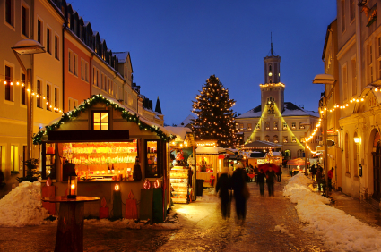

----

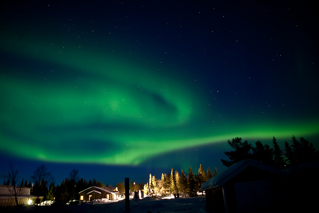

The Swedish word for Christmas is "Jul". It's an old midwinter festival
that has been celebrated in most part of northern europe for at least
1500 years, probably longer.

It took place on the darkest day of the year, the midwinter solstice.

----

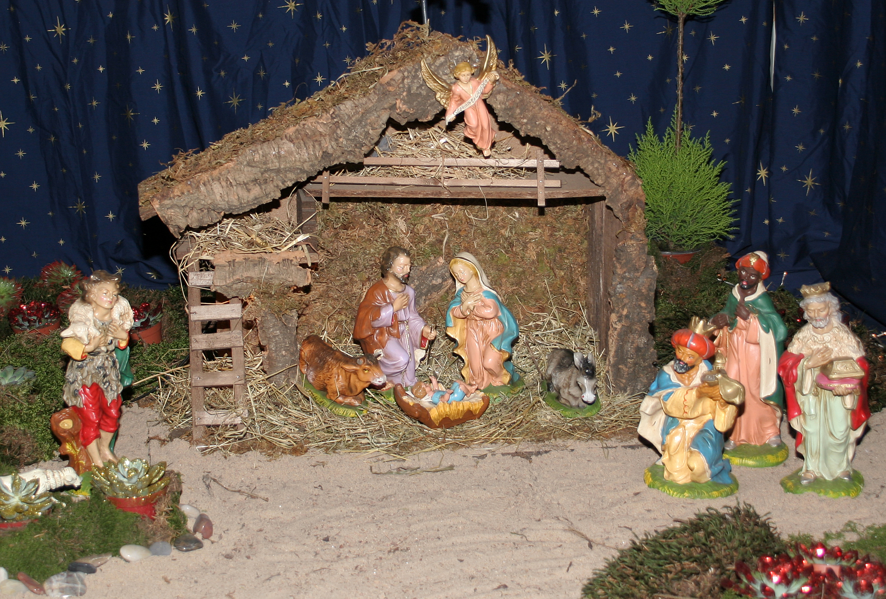

Of course, at the end of the Viking Age, Christianity came to Sweden,
and they said that Jul was about Jesus. Many houses have little dioramas
of Jesus birth.

----

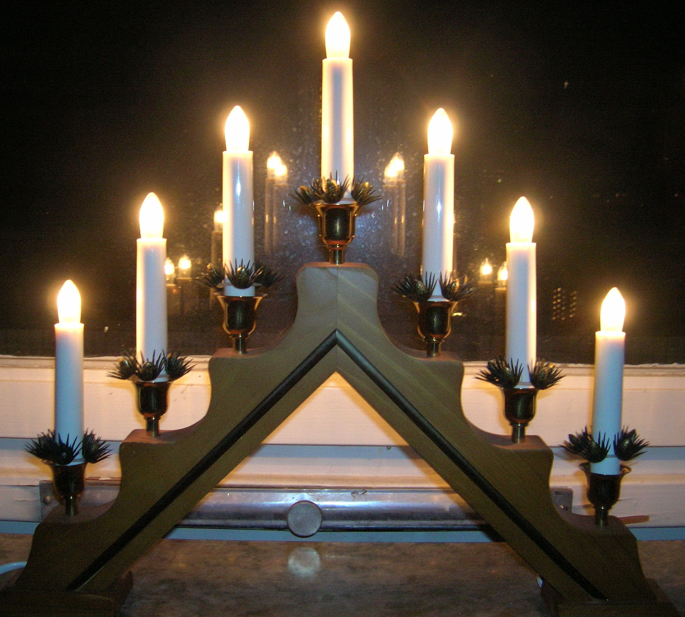

But Christmas has still remained a holiday about light in the darkness.
Four weeks before Christmas is the start of Advent, and in Sweden we put
a lot of lights all around the house. Many people have lights like these
in the window.

----

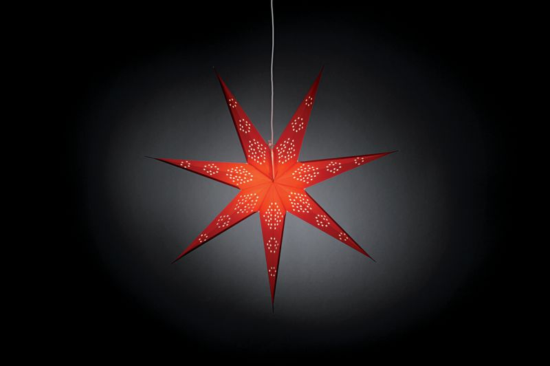

We also hang star-shaped lamps in the windows.

----

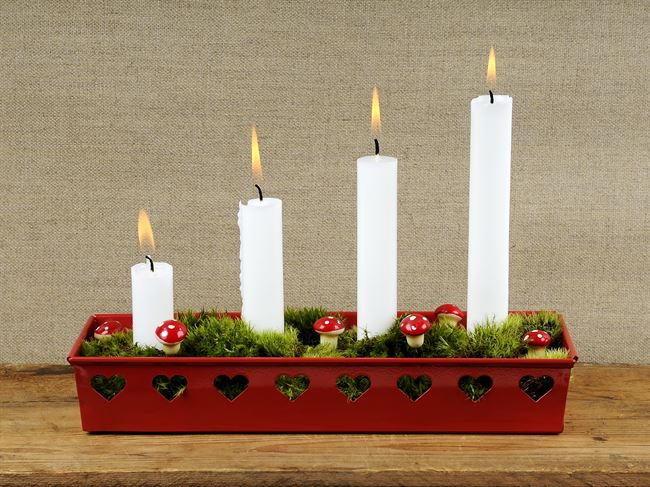

And light candles. In these candle holders you light one candle the
first week of advent, two the next, and so on, up until christmas.

----

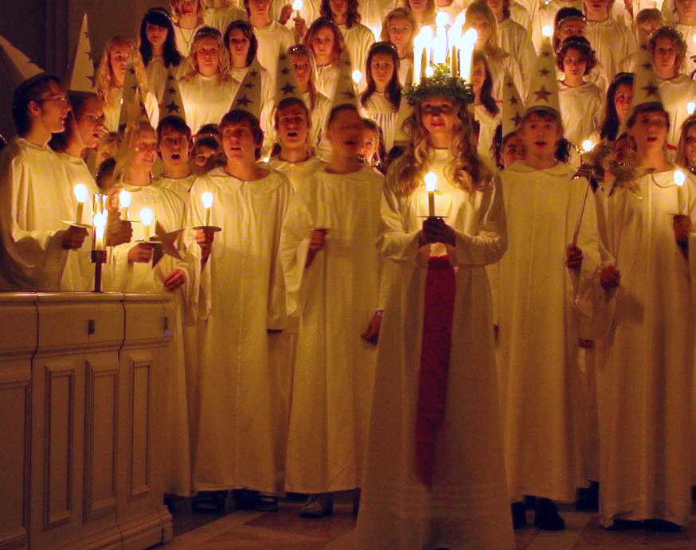

On the day of Saint Lucia somebody dresses up as Saint Lucia and wakes
everybody up by singing Lucia songs.

St Lucia also brings light to the darkness.

----

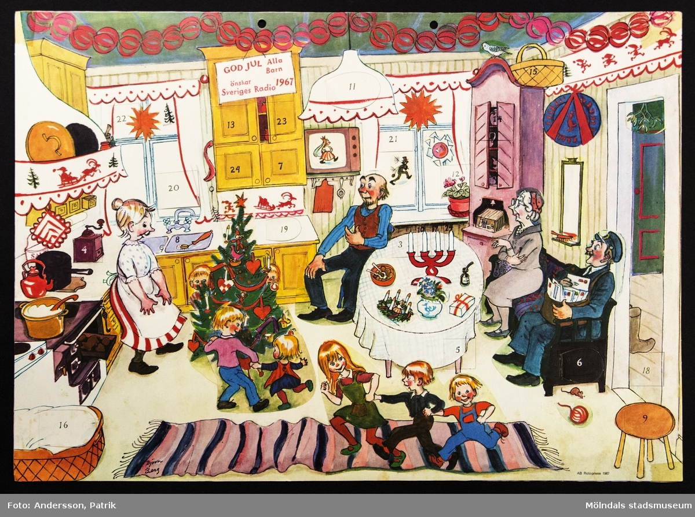

Kalendarz adwentowy are very popular in Sweden. Swedish television makes a
kalendar TV series every year, where it is one episode sent every day for
24 days before christmas.

----

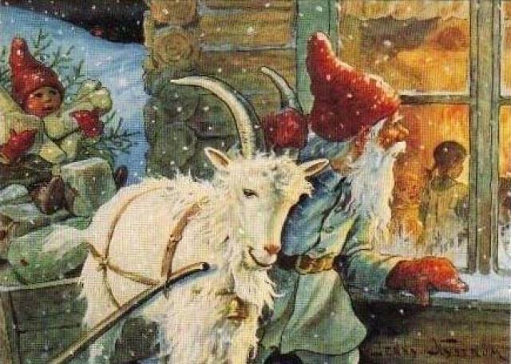

In Sweden the gifts are given on Christmas Eve by the Christmas Gnome.
He knocks on the door and asks "Are there any nice children here?" and
givs them presents.

He rides on a goat or a raindeer.

----

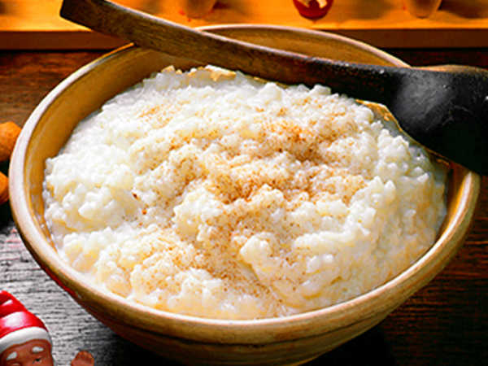

On Christmas eve you eat christmas porridge.
It's a sweet porridge made on milk and rice that you eat with milk an cinnamon.

----

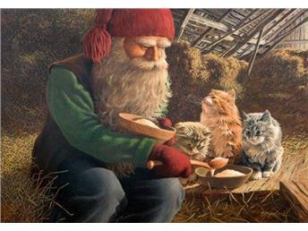

And you have to leave one plate out for the gnome.

----

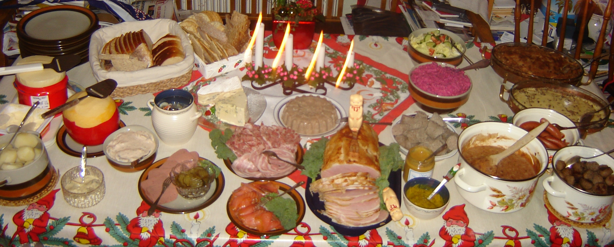

For christmas dinner there is a table full of food, where you pick a little
bit of everything you like. There is a big ham, many kinds of herring and of
course meatballs. We eat a lot of fish for christmas, but not carp.
